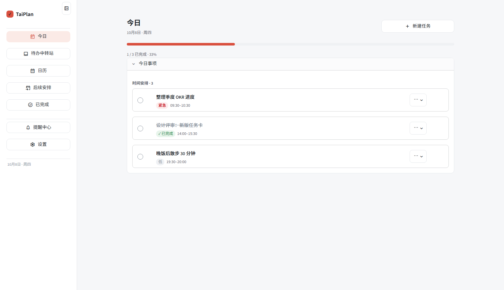

# TaiPlan



**Tasks into time.**

A local-first task and time planning desktop app for Windows.
Designed & Developed by **TaiWoo_Chen**.

Version 0.1.2 · MIT License

[中文说明 / Chinese README](README.zh-CN.md)

---

## What TaiPlan is

TaiPlan is a desktop application that helps you turn a loose list of things to do into
an actual schedule. It combines a lightweight task inbox with a real time-blocking
calendar, so a task is not just "something to remember" but "something with a place in
your day".

Everything runs in a native desktop window. There is no browser address bar, no local
web server you have to keep open, and no account to create.

## Features

### Today
A focused view of what belongs to today: timed tasks in chronological order, all-day
items, plus anything that is overdue. This is the screen you leave open.

### Inbox
A holding area for tasks that do not have a date yet. Capture first, schedule later.

### Calendar & Time Blocking
- Month / week / day views with a built-in navigation bar.
- Drag a task to another date or time slot to reschedule it.
- Drag the bottom edge to change how long a task lasts.
- Click an empty slot, or drag across a time range, to create a task directly on the
  calendar.
- Click an existing task to edit it in place.
- Current-time indicator and configurable time grid (15 / 30 / 60 minutes).
- All-day items and timed items can be converted into each other by dragging.
- Overlapping time blocks are allowed and warned about, never silently dropped.

### Recurrence
- Daily, weekly, monthly and custom-interval series (including weekday-only series).
- Edit a whole series, or change just a single occurrence.
- Occurrences can be moved, retimed and completed independently of the series.
- Deleting a series can keep or remove its past and future occurrences, as you choose.

### Reminders
- Time-based reminders for tasks, evaluated while the app is running.
- Windows system notifications, with an in-app switch.
- A reminder center that lists recent and upcoming reminders.

### AI parsing (optional)
- Type a sentence such as "tomorrow 3pm meeting for 1 hour" and let the AI turn it into
  a structured task (date, time, duration, priority, recurrence).
- Strictly optional: TaiPlan is fully usable with AI switched off.
- You configure your own provider, endpoint and model, and your own API key.

### Interface
- Chinese (zh-CN) and English (en-US) UI, following the system language by default.
- Light and dark appearance, collapsible sidebar, Fluent-inspired look.
- A single continuous Settings page with an on-page table of contents.

### Local-first data
- Task data lives in a local SQLite database in your own user profile.
- No sign-in, no sync service, no telemetry.
- Manual and automatic backups of the database, plus safe import/restore.

## Data and privacy

Core task data is stored locally. AI features are optional.
When AI is enabled, relevant input may be sent to the AI provider configured by the user.

More precisely:

| What | Where |
| --- | --- |
| Tasks, reminders, settings | `%LOCALAPPDATA%\TaiPlan` |
| AI API key | Windows Credential Manager (never written to a file) |

- With AI **disabled** (the default), nothing about your tasks leaves your computer.
- With AI **enabled**, the text you submit for parsing is sent to the provider you
  configured, under that provider's terms. No task data is sent for any other reason.
- The API key is stored in Windows Credential Manager under the service name
  `TaiPlan-AI`. It is not logged, not written into configuration files, and not
  included in backups.

## Install on Windows

1. Run `TaiPlan-Setup-0.1.2.exe`.
2. It installs for the current user only — no administrator rights, and the default
   location is:

   ```
   %LOCALAPPDATA%\Programs\TaiPlan
   ```

3. A Start Menu entry named `TaiPlan` is created.
4. Launch TaiPlan from that entry. You do not need Python or any command line tools.

Requirements: Windows 10 or 11 (64-bit), and the Microsoft Edge WebView2 Runtime
(preinstalled on current Windows 10/11; the installer will point you to it if missing).

Upgrading: run the newer installer over the existing installation. Program files are
replaced; your tasks, settings and API key are kept. If you used an older version under
the previous product name, TaiPlan migrates that data and your saved key on first start,
keeps the old data directory untouched as a fallback, and cleans up the old shortcuts.

Uninstalling removes program files and shortcuts. It does **not** delete your task data
in `%LOCALAPPDATA%\TaiPlan`.

## Run from source (development)

```bat
:: 1. create the environment
py -3.14 -m venv .venv
.venv\Scripts\python.exe -m pip install -r requirements.txt

:: 2. run in the browser (quickest way to iterate)
.venv\Scripts\python.exe -m streamlit run app.py

:: 3. run as a real desktop window (no console)
.venv\Scripts\python.exe desktop_runtime.py

:: 4. run as a real desktop window with a console for logs
.venv\Scripts\python.exe desktop_runtime.py --debug

:: 5. environment self-check (does not start the app)
.venv\Scripts\python.exe launcher.py --check
```

Tests:

```bat
.venv\Scripts\python.exe -m unittest discover -p "test_*.py"
```

Building the Windows executable and installer:

```bat
.venv\Scripts\python.exe build.py            :: onedir build -> dist\TaiPlan
.venv\Scripts\python.exe build_installer.py  :: installer  -> release\TaiPlan-Setup-<version>.exe
.venv\Scripts\python.exe build_release.py    :: the whole release pipeline
```

Developer conventions, project layout and packaging notes are in
[CONTRIBUTING.md](CONTRIBUTING.md). Third-party components and their licenses are listed
in [THIRD_PARTY_NOTICES.txt](THIRD_PARTY_NOTICES.txt).

## Project layout

```
app.py                 Streamlit UI entry point (the page itself)
main.py                single entry point for all run modes
desktop_runtime.py     native window, tray, single-instance lock, IPC, watchdog
services.py            business logic (the only layer the UI calls into)
database.py            the only place that talks SQL
ui/                    theme, layout, reusable components, icons
i18n/                  zh-CN / en-US strings and date localization
calendar_view.py       calendar page and time blocking
recurrence.py          recurrence expansion and occurrence handling
notification_service.py reminder evaluation and delivery
ai_client.py           optional AI provider client
data_dir_migration.py  safe migration of the data directory
packaging_tools.py     version resource and bundle hygiene helpers
```

## License

MIT License. See [LICENSE](LICENSE).

Copyright (c) 2026 TaiWoo_Chen
